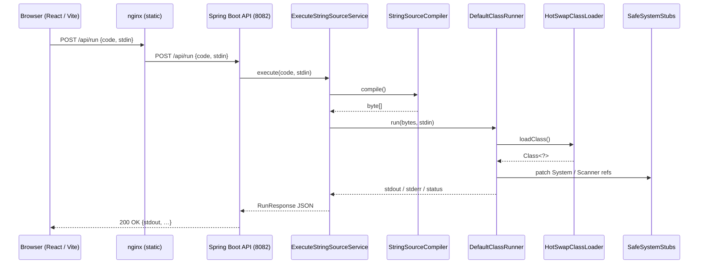

# Project Architecture

## 1 · High-level Diagram

*The browser never talks to the compiler directly; all code stays server-side.*

## 2 · Compilation Pipeline

1. **`StringSourceCompiler`** wraps the JDK `JavaCompiler` API.
2. Custom `InMemoryJavaFileObject/Manager` let us keep sources and
   compiled classes in RAM – no temp files.
3. Diagnostics are collected and returned with ANSI colours stripped so
   they render nicely in the terminal panel.

## 3 · Sandboxing & Byte-code Patching

User byte-code is modified **before** the class is loaded:

| Original                | Rewritten to                        | Reason                              |
|-------------------------|-------------------------------------|-------------------------------------|
| `java/lang/System`      | `org/olexec/sandbox/SafeSystemStubs`| Capture stdout/stderr, block exit   |
| `java/util/Scanner`     | `org/olexec/sandbox/SafeSystemStubs`| Provide thread-local stdin          |

`DefaultBytecodePatcher` walks the constant-pool and substitutes the symbolic
references. A future milestone may replace this with ASM for maintainability.

## 4 · Execution Flow

1. `DefaultClassRunner` patches the byte-array (↑) then asks
   `HotSwapClassLoader` to define the class in its own namespace.
2. Using reflection it invokes `main(String[])` on a worker thread from the
   `userCodeExecutor` pool.
3. `SafeSystemStubs` provides per-thread `InputStream` and `PrintStream`
   instances backed by `IOContextHolder`.
4. When execution ends (or times out) the runner collects output and duration
   and returns a `RunResult` DTO.

Timeouts are enforced with `Future.get(timeout)`; runaway tasks are cancelled.

## 5 · Concurrency / Limits

* Thread-pool size = CPU cores + 1 (configurable via Spring `ExecutorConfig`).
* Default timeout = **15 s** per run.
* Max source size and output size enforced at controller level (TBD).

## 6 · Front-end Overview

| Component             | File                                         | Purpose                       |
|-----------------------|----------------------------------------------|-------------------------------|
| `Editor`              | `frontend/src/components/Editor/Editor.tsx`  | CodeMirror 6 wrapper          |
| `TerminalPanel`       | `…/Terminal/TerminalPanel.tsx`               | Output + stdin + clear button |
| `RunButton`           | `…/RunButton.tsx`                            | Runs code / shows loading     |
| `ClearButton`         | `…/ClearButton.tsx`                          | Clears output                 |
| `SplitPane`           | `…/layout/SplitPane.tsx`                     | Draggable 2-pane layout       |

The front-end dev server (`Vite`) proxies `/api/**` to port 8082 so no CORS
issues occur during development.

## 7 · Deployment

1. **Back-end** compiled into an executable jar,
   e.g. `OnlineExecutor-0.0.1-SNAPSHOT.jar`.
2. **Front-end** static assets built via `npm run build` and served by Nginx.
   See `frontend/Dockerfile` for the multi-stage build.
3. Reverse proxy should forward `/api` to the back-end while serving the SPA. 